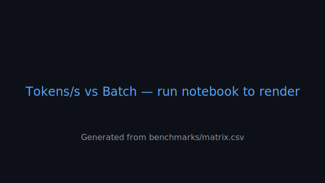

# Benchmark Highlights

All performance data flows into a single source of truth: [`benchmarks/matrix.csv`](../benchmarks/matrix.csv). Each notebook appends rows after the measurement cell runs (with warmups, fixed seed 42, and environment capture).

## Visual Snapshots (auto-refresh once data lands)




Both charts are placeholders until the associated notebooks are executed. Re-generate visuals with:

```bash
python scripts/render_benchmarks.py  # sketches provided under docs/benchmarks.md
```

## How to add new measurements
1. Run the benchmark cell inside a notebook (after two warmup passes).
2. Commit the updated `benchmarks/matrix.csv`.
3. (Optional) Rebuild charts by re-running the helper script and adding updated SVGs under `assets/benchmarks/`.

For detailed methodology see [`benchmarks/protocol.md`](../benchmarks/protocol.md).
